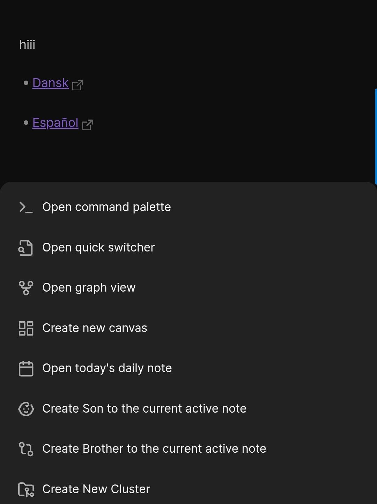

# Cluster plugin mainly designed to simplify the process of note clustering on mobile devices and work well on PCs ether.

### Note Clustering
Note clustering is a way to create a hierarchy or structure among your notes, making it easier to navigate and understand the relationships between them.
**Cluster Plugin** provides commands, in-note buttons,  and ribbon actions to make clustering process easier on mobile devices and work well on PCs ether.
**Simple Example:**
Imagine you have notes about different animals. You could create `Animals cluster`  like:
- Animals (cluster)
    - Mammals (first generation note)
        - Dogs (second generation note)
        - Cats (second generation note)
        - Whales (second generation note)
        
    - Birds (first generation  note)
        - Eagles (second generation note)
        - Penguins (second generation note)
        - Owls (second generation note)

1. From ribbon or using "New cluster" command create "Animals" cluster .
2. From new opened note click "Create Son" with name "Mammals"
3. From new opened "Mammals" note click "Create Son" with name "Dogs"
4. From new opened "Dogs" note click "Create Brother" with name "Cats", 
alternatively you go back to  "Mammals" note click "Create Son" with name "Cats"
5. Continue ...

### 🤩🪄 Features

- Easy note clustering on phones and PCs.
- **Intuitive folders:** Group related notes into folders for maintain a clear hierarchy folder structure.
- Automatically generate useful note properties that's helps with search, graph view and maintain note clustering process.

### 🧩 Requirements 

-   [Obsidian Advanced URI](https://github.com/Vinzent03/obsidian-advanced-uri)  plugin , This plugin is necessary to (Create Son, Create Brother and Delete) links to work.

### ⚙️ PC Recommendation

- Set ` Ctrl+Shift+B ` hotkey to newBrother command.
- Set ` Ctrl+Shift+S ` hotkey to newSon command.
- Set ` Ctrl+Shift+C ` hotkey to newCluster command.
- Set ` Ctrl+Shift+C ` hotkey to newCluster command.
- Set ` Ctrl+Shift+D ` hotkey to  DeleteActiveNote command.
### 📌 Use

##### 💻PC :
- You can use hotkeys to create Cluster, create Son, create Brother and Delete.
-  You can use note options 

- You can use the ribbon actions

##### 📱 Mobile Phone :
- You can use note options 

- You can use the mobile ribbon actions

---

## Credits

Thank you for everyone in the Obsidian community that have contributed to testing and bug reporting.

Some of our inspiration came from the following project
https://github.com/vanadium23/obsidian-advanced-new-file

