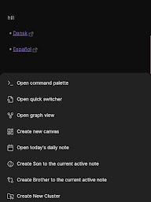

# Cluster plugin mainly designed to simplify the process of note clustering on mobile devices and work well on PCs ether.

### 🤩🪄 Features

- Easy note clustering on phones and PCs.
- **Intuitive folders:** Group related notes into folders for maintain a clear hierarchy folder structure.
- Automatically generate useful note properties that's helps with search, graph view and maintain note clustering process.

### 🧩 Requirements 

-   [Obsidian Advanced URI](https://github.com/Vinzent03/obsidian-advanced-uri)  plugin , This plugin is necessary to (Create Son, Create Brother and Delete) links to work.

### ⚙️ PC Recommendation

- Set ` Ctrl+Shift+B ` hotkey to newBrother command.
- Set ` Ctrl+Shift+S ` hotkey to newSon command.
- Set ` Ctrl+Shift+C ` hotkey to newCluster command.
- Set ` Ctrl+Shift+C ` hotkey to newCluster command.
- Set ` Ctrl+Shift+D ` hotkey to  DeleteActiveNote command.
### 📌 Use

##### 💻PC :
- You can use hotkeys to create Cluster, create Son, create Brother and Delete.
-  You can use note options 

- You can use the ribbon actions

##### 📱 Mobile Phone :
- You can use note options 

- You can use the mobile ribbon actions

---

## Credits

Thank you for everyone in the Obsidian community that have contributed to testing and bug reporting.

Some of our inspiration came from the following project
https://github.com/vanadium23/obsidian-advanced-new-file

